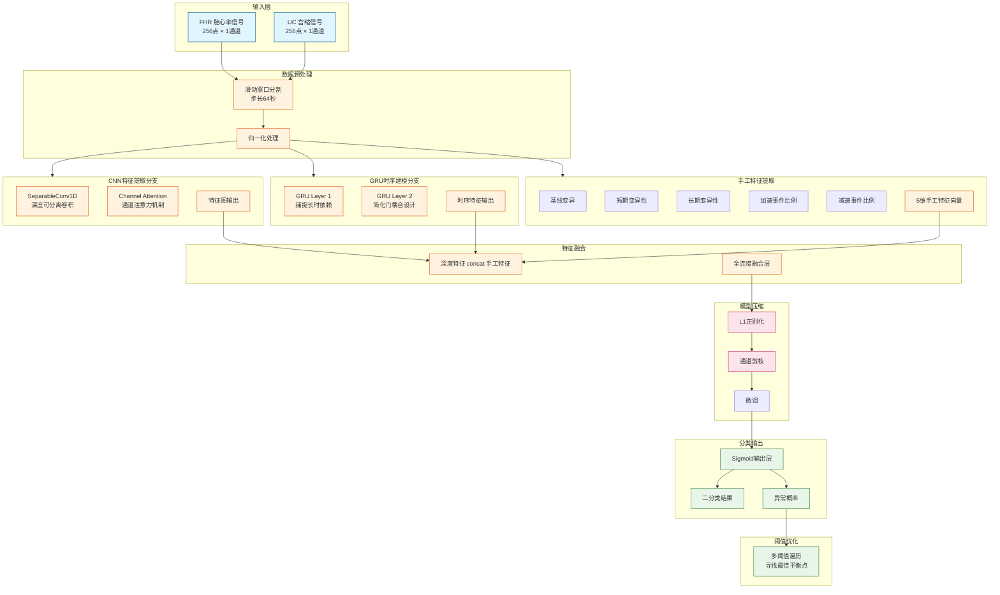

# 胎心信号异常检测轻量化CNN-GRU模型训练流程

## 1. 流程图（Mermaid语法）



---

## 2. 简化版流程图（论文插图用）

```
┌─────────────────────────────────────────────────────────────────────────────┐
│                              模型训练流程                                    │
├─────────────────────────────────────────────────────────────────────────────┤
│                                                                             │
│   ┌──────────┐     ┌──────────┐                                            │
│   │FHR信号   │     │UC信号    │                                            │
│   │256×1     │     │256×1     │                                            │
│   └────┬─────┘     └────┬─────┘                                            │
│        │               │                                                    │
│        └───────┬───────┘                                                    │
│                ▼                                                            │
│      ┌─────────────────┐                                                   │
│      │   滑动窗口分割   │                                                   │
│      │  步长64秒/窗口   │                                                   │
│      └────────┬────────┘                                                   │
│               ▼                                                            │
│      ┌─────────────────┐     ┌─────────────────────┐                      │
│      │   归一化处理     │────▶│   手工特征提取        │                      │
│      └────────┬────────┘     │  基线/短期变异/加速/.. │                      │
│               │              └──────────┬──────────┘                      │
│        ┌─────┴─────┐                    │                                   │
│        ▼           ▼                    ▼                                   │
│  ┌───────────┐ ┌───────────┐    ┌──────────────┐                            │
│  │CNN分支    │ │GRU分支     │    │ 5维特征向量   │                            │
│  │Separable │ │双层GRU    │    │              │                            │
│  │Conv1D    │ │长时依赖    │    └──────┬───────┘                            │
│  │Channel   │ │            │           │                                   │
│  │Attention │ │            │           │                                   │
│  └─────┬────┘ └─────┬──────┘           │                                   │
│        │           │                  │                                   │
│        └─────┬─────┘                  │                                   │
│              ▼                        ▼                                    │
│      ┌────────────────────┐ ┌──────────────────┐                          │
│      │   特征融合层        │ │  全连接层         │                          │
│      │  深度特征+手工特征  │ │                  │                          │
│      └─────────┬──────────┘ └──────────┬───────┘                          │
│                │                      │                                   │
│                └──────────┬───────────┘                                   │
│                           ▼                                               │
│                 ┌─────────────────┐                                       │
│                 │ L1正则化+通道剪枝 │                                      │
│                 └────────┬────────┘                                       │
│                          ▼                                                │
│                 ┌─────────────────┐                                       │
│                 │  微调恢复性能     │                                      │
│                 └────────┬────────┘                                       │
│                          ▼                                                │
│                 ┌─────────────────┐                                       │
│                 │ Sigmoid输出层    │                                       │
│                 │ 二分类概率        │                                       │
│                 └────────┬────────┘                                       │
│                          ▼                                                │
│                 ┌─────────────────┐                                       │
│                 │  多阈值遍历优化   │                                      │
│                 │  最佳平衡点       │                                      │
│                 └─────────────────┘                                       │
│                                                                             │
└─────────────────────────────────────────────────────────────────────────────┘
```

---

## 3. 各模块详细说明

| 模块 | 具体操作 | 说明 |
|------|---------|------|
| **输入层** | FHR(256×1) + UC(256×1) | 双通道原始信号 |
| **滑动窗口** | 256点/窗口, 步长64 | 64秒数据段 |
| **归一化** | Min-Max归一化 | 0-1范围 |
| **CNN分支** | SeparableConv1D + Channel Attention | 提取局部突变特征 |
| **GRU分支** | 2层GRU (简化门耦合) | 捕捉长时依赖 |
| **手工特征** | 5维: 基线/短期变异/长期变异/加速/减速 | 辅助深度特征 |
| **特征融合** | concat + Dense | 深度特征与手工特征融合 |
| **模型压缩** | L1正则化 + 通道剪枝 | 轻量化 |
| **多阈值优化** | 遍历阈值找最佳F1 | 解决类别不平衡 |

---

## 4. 关键参数

- **采样率**: 4Hz
- **窗口大小**: 256点 (64秒)
- **CNN层**: 深度可分离卷积 + 通道注意力
- **GRU层**: 双层, 隐藏单元数待定
- **手工特征**: 5维
- **正则化**: L1
- **阈值优化**: 遍历[0.1, 0.9]找最佳阈值